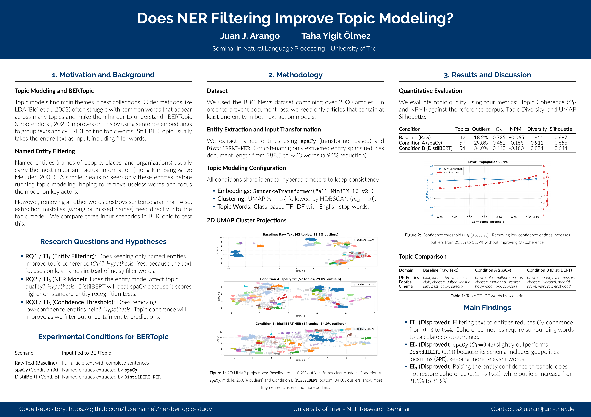

# Entity-Centric Topic Modeling with BERTopic

**Research Seminar in Natural Language Processing — University of Trier**  
**Authors:** Juan J. Arango & Taha Yigit Ölmez  
**Supervision:** Department of Digital Humanities / Computer Science  

---

## Overview

This repository contains the empirical experiments, code, and LaTeX source files for our research poster evaluating whether Named Entity Recognition (NER) filtering improves BERTopic clustering quality and downstream topic coherence ($C_V$, NPMI), or introduces an information bottleneck that degrades semantic structure.

### Experimental Setup
We evaluate on the **BBC News benchmark** (2,224 articles across Business, Entertainment, Politics, Sport, and Technology) under three conditions:
1. **Baseline (Control):** Full raw text with standard English stopword filtering at c-TF-IDF.
2. **Condition A:** Named entity filtering using `spaCy` (`en_core_web_trf`), retaining `PER`, `ORG`, `LOC`, and `GPE`.
3. **Condition B:** Named entity filtering using `DistilBERT-NER` (`dslim/distilbert-NER`), retaining `PER`, `ORG`, and `LOC`.

To eliminate document-loss artifacts, articles are synchronized in a strict 1:1:1 alignment across all conditions (2,223 aligned articles).

---

## Key Findings

| Condition | Pipeline | Topics | Outliers (%) | $C_V$ Coherence | NPMI | Topic Diversity | Silhouette |
| :--- | :--- | :---: | :---: | :---: | :---: | :---: | :---: |
| **Baseline** | Raw Text + Stopwords | 42 | **18.2%** | **0.73** | **+0.06** | 0.85 | **0.69** |
| **Condition A** | spaCy (`en_core_web_trf`) | 57 | 29.0% | 0.45 | -0.16 | **0.91** | 0.66 |
| **Condition B** | DistilBERT (`dslim/distilbert-NER`) | 54 | 34.0% | 0.44 | -0.18 | 0.87 | 0.64 |

* **Coherence Penalty:** Stripping non-entity descriptive context creates an information bottleneck that harms sliding-window co-occurrence metrics ($C_V$ drops from $0.73 \to 0.44$).
* **Diversity Gain:** Entity filtering significantly increases topic diversity ($0.85 \to 0.91$), preventing repetitive generic terms across clusters.
* **Error Propagation:** Sweeping confidence thresholds $\tau \in [0.30, 0.95]$ shows that raising confidence thresholds does not recover coherence, but increases outlier rates beyond $30\%$.

---

## Repository Structure

```
├── Main_Code.ipynb             # Complete end-to-end Jupyter notebook
├── generate_poster_deliverables.py  # Standalone CLI script for full reproducibility
├── requirements.txt            # Python dependencies
├── Makefile                    # Automation for building poster and appendix PDFs
├── latex/                      # LaTeX source files
│   ├── poster.tex              # DIN A1 landscape poster (Gemini beamer theme)
│   ├── appendix.tex            # Mandatory 2-page appendix (References & Integrity)
│   ├── references.bib          # BibTeX bibliography
│   └── figures/                # Visual deliverables used in the poster
├── figures/                    # Generated high-resolution figures (300 DPI)
├── results/                    # Quantitative evaluation metrics and sweep CSVs
└── output/                     # Compiled deliverables
    ├── poster.pdf              # DIN A1 Research Poster
    ├── appendix.pdf            # Accompanying Appendix PDF
    └── poster_preview.png      # Visual poster preview
```

---

## Quickstart & Reproduction

### 1. Environment Setup
```bash
python3 -m venv .venv
source .venv/bin/activate
pip install -r requirements.txt
python -m spacy download en_core_web_trf
```

### 2. Running the Analysis
You can execute the entire pipeline interactively via the notebook:
```bash
jupyter notebook Main_Code.ipynb
```
Or run the headless deliverable generation script:
```bash
python generate_poster_deliverables.py
```

### 3. Compiling Poster & Appendix
Compiling the LaTeX documents requires a TeX Live installation with `lualatex` and `pdflatex`:
```bash
make all        # Builds poster.pdf, appendix.pdf, and preview image
make poster     # Builds output/poster.pdf
make appendix   # Builds output/appendix.pdf
```

---

## Deliverables Preview

### Research Poster (DIN A1)


---

## Citation & References

See [latex/references.bib](latex/references.bib) and the accompanying [Appendix](output/appendix.pdf) for the complete list of academic citations.

