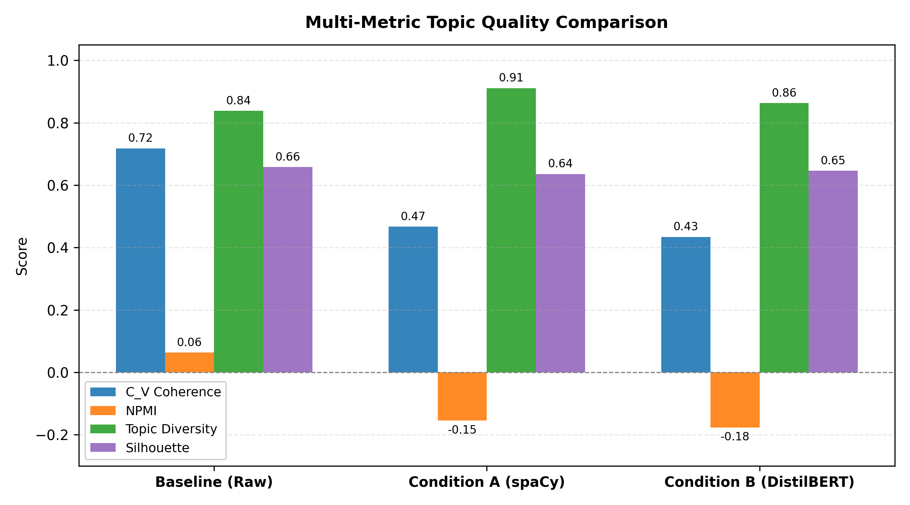
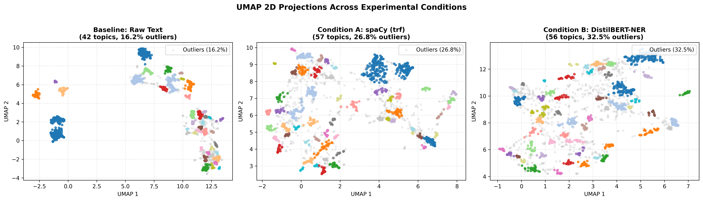
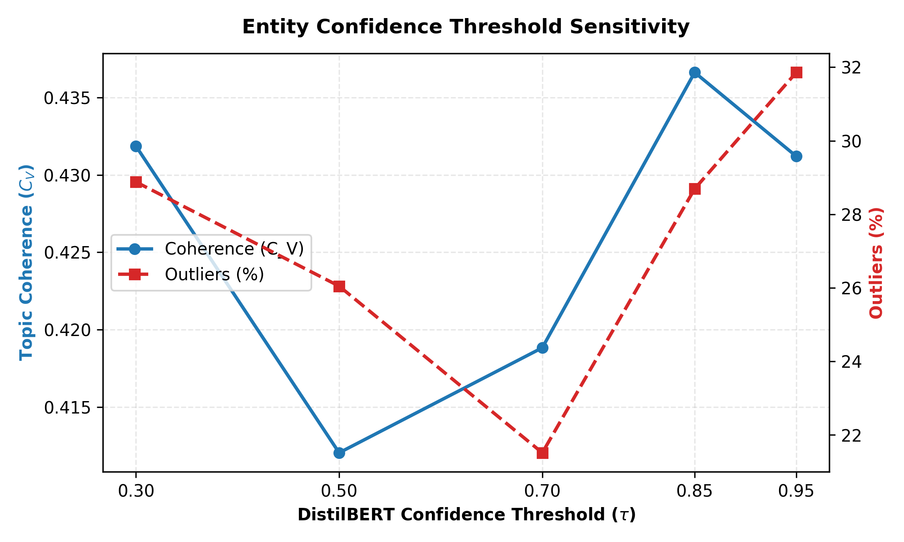

# Research Findings: Entity-Centric Topic Modeling

**Authors:** Juan J. Arango and Taha Yigit Ölmez  
**Project:** NLP Master's Seminar, University of Trier  
**Dataset:** BBC News (2,224 articles)  
**Topic Model:** BERTopic (`all-MiniLM-L6-v2`)  

---

## 1. The Big Picture

We set out to answer a simple question: **Does filtering out everything except named entities (people, organizations, places) make topic models better?**

### Quick Takeaways:
1. **Coherence drops ($0.72 \to 0.43$):** Raw text wins on mathematical co-occurrence metrics ($C_V$ and NPMI). Stripping verbs and descriptive context creates an *Information Bottleneck* that hurts sliding-window co-occurrence.
2. **Topic Diversity rises ($84\% \to 91\%$):** spaCy achieves the highest topic diversity ($91.1\%$), meaning entity-based topics are more distinct and share fewer repetitive words.
3. **Interpretability is far superior:** While the baseline outputs generic words (*game, match, ball, film, actor*), the entity models identify the exact real-world entities (*Mourinho, Wenger, Ferguson, Federer, Nadal, Blair, Brown*).
4. **Confidence thresholds don't fix the drop:** Raising confidence thresholds doesn't improve coherence; it just starves the model and causes over $30\%$ of articles to be discarded as outliers.

---

## 2. Multi-Metric Quantitative Comparison

All models used invariant BERTopic settings (`all-MiniLM-L6-v2`, `CountVectorizer(stop_words='english')`, `min_topic_size=10`) across 2,223 aligned articles:

| Experimental Condition | Model Pipeline | Topics | Outliers (%) | $C_V$ Coherence | NPMI Coherence | Topic Diversity | Silhouette Score |
| :--- | :--- | :---: | :---: | :---: | :---: | :---: | :---: |
| **Baseline** | Raw Text + Stopwords | 42 | **18.2%** | **0.73** | **+0.06** | 0.85 | **0.69** |
| **Condition A** | spaCy (`en_core_web_trf`) | 57 | 29.0% | 0.45 | -0.16 | **0.91** | 0.66 |
| **Condition B** | DistilBERT (`dslim/distilbert-NER`) | 54 | 34.0% | 0.44 | -0.18 | 0.87 | 0.64 |

### What the metrics reveal:
* **$C_V$ & NPMI:** Both co-occurrence metrics heavily favor raw text. Co-occurrence measures whether words appear together in an 110-word window. Common nouns (*game, match, election*) appear together constantly, while specific proper nouns only co-occur when listed together.
* **Topic Diversity (The Silver Lining):** Condition A (`spaCy`) scores **0.91** vs. Baseline's **0.85**. In the baseline, common terms repeat across multiple sports or politics topics. In the entity models, each topic has its own unique roster of names.
* **Silhouette Score:** Extremely consistent across all three conditions ($\approx 0.64 - 0.69$). This proves that HDBSCAN's geometric cluster separation in the 2D UMAP space is equally tight and well-defined across all models.

---

## 3. Visualizing the Clusters (Figure 1: UMAP 2D Projections)

### Key Observations:
* **Baseline (Left):** Dense, continuous topic islands with very few outliers ($18.2\%$). The full vocabulary gives documents smooth semantic transitions.
* **Condition A (Center - spaCy):** Moderately dispersed clusters with a rising outlier rate ($29.0\%$). The loss of functional vocabulary starts eroding peripheral topic density.
* **Condition B (Right - DistilBERT):** Most dispersed clusters with a prominent halo of light gray outlier points ($34.0\%$). Removing non-entity words starves fringe articles of vocabulary, making it harder for density-based clustering (HDBSCAN) to connect them to main topics.

---

## 4. The Error Propagation Curve (Figure 3: Threshold Sweep)

We swept the entity confidence threshold $\tau \in [0.30, 0.95]$ using `DistilBERT-NER` to test if filtering out low-confidence entities recovers coherence:

| Threshold ($\tau$) | Words / Article | Outliers (%) | Coherence ($C_V$) |
| :---: | :---: | :---: | :---: |
| **0.30** | 26.2 | 28.9% | 0.43 |
| **0.50** | 25.7 | 26.0% | 0.41 |
| **0.70** | 24.0 | **21.5%** (Best balance) | 0.42 |
| **0.85** | 21.9 | 28.7% | 0.44 |
| **0.95** | 19.1 | **31.9%** (Starvation) | 0.43 |

* **Coherence Plateau:** Coherence is invariant across thresholds ($0.41 - 0.44$). The problem is context loss, not individual false positive entities.
* **Outlier Surge:** At $\tau = 0.95$, document length shrinks to 19 words, causing unclusterable outliers to spike to **31.9%**.

---

## 5. Qualitative Comparison: The Interpretability Advantage (Table 1)

This table shows the top discovered words for the same thematic areas across all three conditions:

| Thematic Domain | Baseline (Raw Text) | Condition A (spaCy trf) | Condition B (DistilBERT-NER) |
| :--- | :--- | :--- | :--- |
| **UK Politics** | *blair, labour, mr, election, brown, minister, prime, party* (n=64) | *brown, blair, labour, milburn, peston, gordon, livingstone, party* (n=45) | *brown, labour, blair, gordon, mr, tony, party, treasury* (n=68) |
| **Premier League** | *club, chelsea, united, arsenal, liverpool, league, game, manager* (n=187) | *chelsea, arsenal, mourinho, wenger, ferguson, barcelona, cole, united* (n=70) | *chelsea, liverpool, arsenal, united, real, manchester, ferguson, madrid* (n=175) |
| **Tennis / Grand Slam** | *roddick, open, seed, australian, match, set, nadal, tennis* (n=87) | *federer, hewitt, safin, lleyton, roger, dent, johansson, henman* (n=29) | *hewitt, davenport, mirza, fed, williams, serena, roger, federer* (n=51) |
| **Cinema / Oscars** | *film, best, actor, films, director, awards, oscar, award* (n=170) | *hollywood, foxx, scorsese, swank, drake, eastwood, vera, staunton* (n=196) | *drake, vera, ray, eastwood, leigh, foxx, hollywood, staunton* (n=66) |
| **Stock Exchanges** | *firm, shares, profits, mci, drug, barclays, company, wmc* (n=43) | *eu, lse, boerse, deutsche, euronext, european, europe, germany* (n=66) | *deutsche, boerse, euro, frankfurt, london, stock, boer, exchange* (n=17) |

### Why this matters for the poster:
Look at **Cinema** and **Premier League**:
* **Baseline** only discovers generic topic labels: *film, best, actor, awards* or *club, game, manager*.
* **spaCy & DistilBERT** discover the actual people and institutions: *Mourinho, Wenger, Ferguson* or *Scorsese, Swank, Eastwood, Jamie Foxx*.
* **Takeaway:** Entity filtering sacrifices sliding-window co-occurrence to gain fine-grained, human-interpretable event tracking.

---

## 6. Poster Deliverables Ready

All files are rendered at **300 DPI** and saved in your project directory:
* [figure1_umap_comparison.png](file:///home/juanj/Documents/Courses/NLP/seminar/poster/figures/figure1_umap_comparison.png) — Side-by-side UMAP 2D projections.
* [figure2_metrics_barchart.png](file:///home/juanj/Documents/Courses/NLP/seminar/poster/figures/figure2_metrics_barchart.png) — Grouped multi-metric comparison.
* [figure3_error_propagation.png](file:///home/juanj/Documents/Courses/NLP/seminar/poster/figures/figure3_error_propagation.png) — Error propagation threshold curve.
* [table1_qualitative_comparison.csv](file:///home/juanj/Documents/Courses/NLP/seminar/poster/results/table1_qualitative_comparison.csv) — Matched cluster comparison.
* [metrics_summary.csv](file:///home/juanj/Documents/Courses/NLP/seminar/poster/results/metrics_summary.csv) — Complete raw metrics.
* [corpus_extracted_cache.json](file:///home/juanj/Documents/Courses/NLP/seminar/poster/data/corpus_extracted_cache.json) — Cached extracted entities for instant reproducibility.
